# weaviate入门
- 特点
    - 1. 开源；2. 同时存储对象和向量，从而支持混合检索；3. 提供GraphQL、REST、gRPC等API; 4. 低延迟、高精度;4. 由Go编写
- 入门
    - 1. 创建weaviate数据库实例：weaviate提供了云服务(WCS，AWS，Google Cloud)、docker compose、Kubernets、Embeded四种创建方式
    - 2. 安装并实例化客户端：weaviate提供了python,js/ts, go,java等客户端。```pip install -U --pre "weaviate-client==v4.4b2"```。注意，如果以Embeded方式提供服务，数据库的实例化和client的实例化是在同一步，且embeded客户端与其他客户端的方法也存在较大差别。
    - 3. 客户端连接数据库
    - 4. 定义数据集合(data collection),数据集合类似于SQL中的表，此处可指定embedding模型， **如果不指定embedding模型，则需要自己将query转化为向量（推荐，更灵活）**
    - 5. 向定义的data collection中，插入数据
    - 6. 执行查询。包括语义查询、混合查询、语义查询后过滤，weaviate支持基于LLM进行直接查询生成
- 主要概念
    - 数据结构
        - 在weaviate中，数据对象存储在class-based collection中，每个数据对象都有属性，class-based collection由schema定义，数据存储以json的形式，embedding保存在json的vector字段中。如果两个数据对象间存在关系，weaviate支持对它们添加cross-references。schema用于定义数据对象的管理和存储形式，包含class,class的属性，可能的图连接，class的向量化模块（故而每个class都可以有自己的向量空间），索引配置。weaviate支持多租户管理，但非多租户对象与多租户对象间不能建立图连接，多租户对象间也不能建立图连接。对于具有 6 个属性的类，我们可以在单个节点上存储约 70,000 个租户，weaviate的测试中，使用 n1-standard-8 机器的 9 节点集群可以容纳大约 17 万个活跃租户，每个节点有 18-19k 个租户。 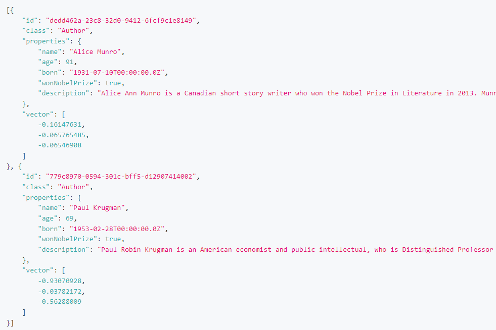
    - 模块组成
        - 这里dense retriever可能指reranker。 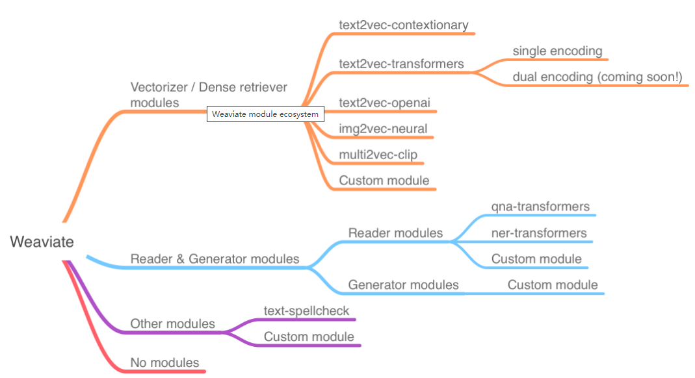
            - text2vec-transformers模块仅与封装在 Docker 容器中的模型兼容,因此使用自选模型必须构建镜像，实例化镜像即运行容器有两种选择：1. 直接构建到weaviate镜像中，并运行weaviate容器；2. 运行一个专门的inference容器，以TRANSFORMERS_INFERENCE_API的形式提供inference服务。
    - 存储
        - Weaviate 是一个持久且容错的数据库，每个写入操作都会立即持久化，并且能够容忍应用程序和系统崩溃，搜索查询中，Weaviate 返回整个对象，将结构化搜索与矢量搜索相结合时，会在执行矢量搜索之前进行过滤。即使在从数据库读取时，数据对象也可以随意更新或删除。
        - Weaviate 中，用户定义schema的每个class都会在内部创建索引。 索引是一种wrapper type，由一个或多个分片(shard)组成。 索引中的分片是独立的存储单元。 可以使用多个分片在多个服务器节点之间自动分配负载。每个分片包含三个主要组件：数据对象存储，本质上是键值存储，倒排索引，向量索引存储（可插入，当前是 HNSW 的自定义实现）。
            - **对象和倒排存储** ：从 v1.5.0 版本开始， **对象和倒排存储是使用 LSM-Tree 方法实现的** 。 这意味着数据可以以内存的速度摄取，并且在达到配置的阈值后，Weaviate 会将整个（已排序）内存表写入磁盘段。 当读取请求到来时，Weaviate 将首先检查 Memtable 以获取特定对象的最新更新。 如果内存表中不存在，Weaviate 将检查所有先前写入的段(segment)（从最新的段开始）。 为了避免检查不包含所需对象的段，使用Bloom过滤器。 **Weaviate 定期将较旧的较小段合并为较少的较大段。 由于段已经排序，这是一个相对低成本的操作，从而可以在后台不断执行。**  **更少、更大的段将使查找更加高效。** 特别是在数据很少被替换且经常附加的倒排索引上，Weaviate 可以检查单个段（或几个大段）并立即找到所有需要的对象指针，而不是检查所有过去的段并聚合潜在结果。 此外，段用于删除不再需要的对象的过去版本，例如删除或多次更新后。
                - The log-structured merge-tree (LSM-tree)：LSM-Tree旨在解决B+ Tree在磁盘数据库使用中的缺陷：B+ Tree在数据写入时需要进行复杂的平衡调整操作，并且随着数据量的增加导致叶子结点分裂使得连续的数据存储在不同的磁盘块上，使得数据的随机读写概率增加，在做范围查询的时候会引起较高的磁盘 IO消耗。为了解决这些缺陷，LSM Tree将写操作（包括数据插入、修改、删除）采用追加写的方式写入内存中并进行预排序（C0 Tree，即MemTable)，当C0 Tree的大小达到一定阈值后再将数据顺序写入磁盘中（C1 Tree，即SSTable)，这使得LSM Tree具有良好稳定的写性能；但是读操作时需要顺查询MemTable和SSTable中数据，为了提高读性能，LSM Tree会定期对磁盘中的SSTable文件进行合并，合并时会对同一数据的追加写操作进行合并，减少数据量。
                - 布隆过滤器(Bloom Filter)是1970年由Bloom提出的，它是由一组哈希（Hash）函数和一个位阵列组成。布隆过滤器可以用于查询一个元素是否存在于一个集合当中，查询结果为以下二者之一：这个元素 **可能** 存在于这个集合当中;这个元素 **一定** 不存在于这个集合当中.布隆过滤器的优点是空间效率和查询时间都比一般的算法要好的多，缺点是有一定的误识别率和删除困难，主要用于大集合中重复元素判断和缓存击穿等问题。
            - **向量存储** ：每个分片在上述结构化存储附近都包含自己的向量索引，向量存储与对象存储的内部结构无关。因此，它不会遇到分段问题。 **通过将向量索引与对象存储分开，Weaviate 可以确保每个分片都是一个完全独立的单元** ，可以独立地为其拥有的数据提供服务。 通过将向量索引放置在对象存储附近（而不是内部），Weaviate 可以避免分段向量索引的缺点
            - **分片优化：** Weaviate 的存储机制对结构化/对象数据使用分段。分段的合并成本很低，而且借助Bloom过滤器，甚至可以有效地导航未合并的分段。反过来，摄取速度很快并且不会随着时间的推移而退化。Weaviate 在分片内保持尽可能大的向量索引，因为HNSW 索引无法高效地合并，而且查询单个大索引比顺序查询多个小索引更有效。 **创建多个分片可以有效地使用多 CPU资源，因此为了实现最快的导入，即使在单个节点上也可以创建多个分片。**
            - **灾备** ：防止崩溃时数据丢失，每个操作都会另外写入预写日志 (WAL)，WAL 是append-only文件，写入非常高效，并且很少成为摄取瓶颈。一旦无法创建 WAL 条目，LSM 存储将尝试在有序关闭时刷新段。 只有操作成功，WAL 才会被标记为“完成”。 这意味着如果发生意外崩溃并且 Weaviate 遇到“不完整”的 WAL，它将从此处恢复。 作为恢复过程的一部分，Weaviate 将根据 WAL 刷新一个新段并将其标记为完成。 因此，将来的重新启动将不再需要从此 WAL 中恢复。对于 HNSW 向量索引，WAL 有两个用途：它既是灾难恢复机制，也是主要的持久性机制。 建立 HNSW 索引的成本在于弄清楚在哪里放置新对象以及如何将其与其邻居链接。 WAL 仅包含这些计算的结果。 因此，通过将 WAL 读入内存，HNSW 索引将处于与关闭之前相同的状态。为了保持 WAL 信息的及时性，后台进程将不断压缩 WAL 文件并删除冗余信息。
    - 索引
        - 倒排索引：Weaviate有两个倒排索引用于过滤或搜索数据。第一个（可过滤）索引用于构建快速的 Roaring Bitmaps 索引，第二个（可搜索）索引用于 BM25 或混合搜索。构建class时properties字段中的indexFilterable 和indexSearchable 键可以在属性级别设置为true（打开）或false（关闭），两者均默认开启。如果不想设置任何索引可以在构建class时，设置skip字段为true. 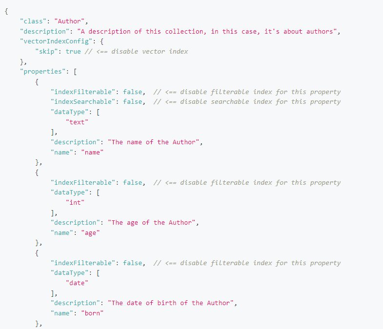
        - ANN索引：用于向量检索，默认索引方式为HNSW。 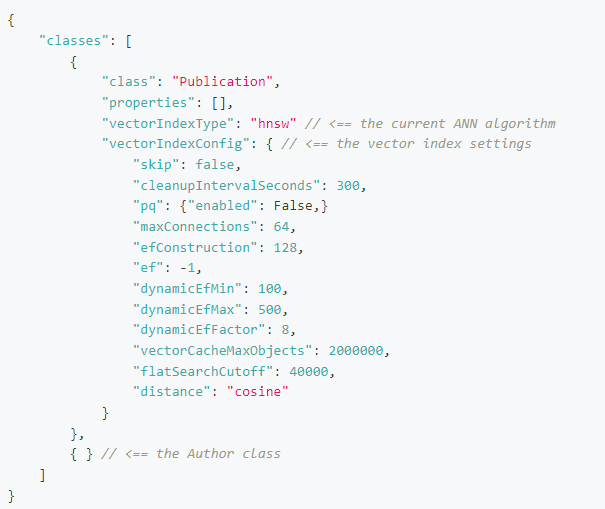
            - 相似度计算优化（在1.4之前仅支持certainty即标准化的距离）。单指令多数据流（SIMD）机器是目前一种较为成熟和流行的并行处理系统 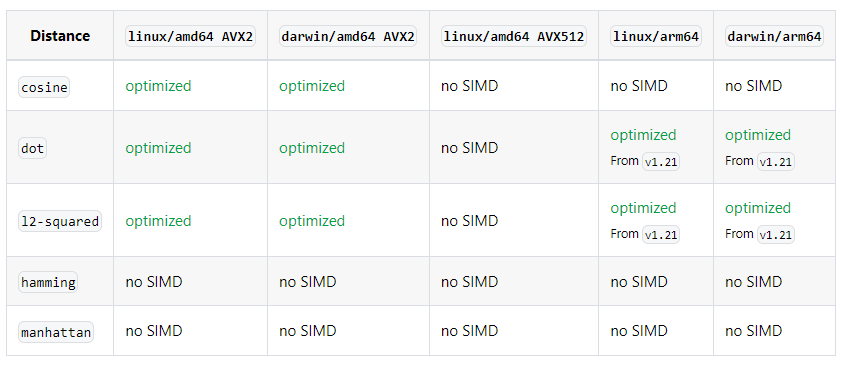
            - 支持的相似测度 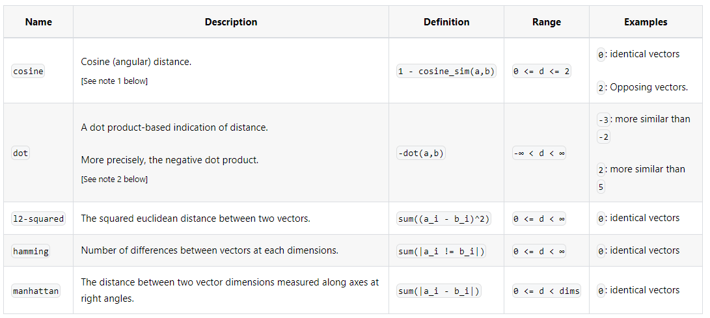
            - HNSW参数配置：ef 参数是平衡搜索速度和质量之间的关键设置。ef 参数指示 HNSW 算法在搜索过程中使用的动态列表的大小。较高的 ef 值会导致更广泛的搜索，从而提高准确性，但可能会减慢查询速度。Weaviate 允许显式或动态配置 ef。如果 ef 设置为 -1，Weaviate 会根据查询响应限制动态调整它，从而实现更灵活的方法来管理这种权衡。动态配置ef的参数如图所示： 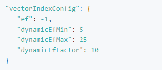
            - Weaviate支持针对HNSW的Product Quantization，和Flat的Binary Qunatization
    - 过滤
        - Weaviate支持基于Roaring Bitmaps的前过滤机制，过滤的对象为属性。当过滤器过于严格时，weaviate的后续语义搜索会逐渐转向暴力搜索。从 v1.8.0 开始，过滤器的倒排索引部分可以被缓存和重用，且允许跨不同的向量搜索。其机制为把过滤后的对象缓存到硬盘，weaviate会根据hash自动清理过时的缓存 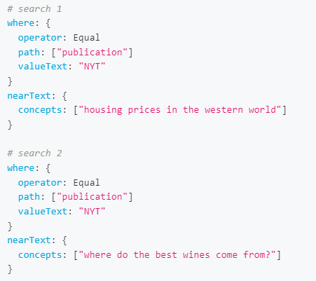
    - reranker
        - Weaviate支持cohere, transformers支持的reranker模型.但transformers的reranker仅支持特定几个模型，不建议docker-compose时配置。 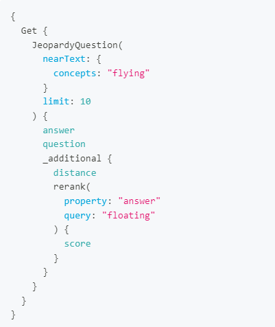
    - 横向扩展
        - 目标：1. 最大化数据库容量， 方法是跨集群在多个节点进行分片；2. 高查询吞吐量，方法是在集群中的多个节点上复制class. 3. 高可用，指在某个节点不工作时数据库整体仍能提供服务，方法是在集群中的多个节点上复制class。创建多个分片，即使在单个节点创建多个分片，也能有效地使用多 CPU资源，及加快import速度，但会拖慢吞吐速度。提供备份数量，可以提高可用性，得到接近线性的查询吞吐量，但会降低import速度。weaviate使用64bit Murmur-3 hash作为分片算法。
        - 再分片：Weaviate 使用虚拟分片系统将对象分配给分片，能够使重新分片时发生的数据移动最少。 但 HNSW 索引机制使重新分片是一个非常昂贵的过程，应该尽量少的使用。 就需要移动的数据量而言，重新分片的成本大致相当于初始导入的成本。节点发现：集群中的节点通过 Hashicorp 的 Memberlist 使用类似gossip-like协议来传达节点状态和故障情况。分片和/或复制分片的节点关联性：weaviate 总是尝试选择具有最多可用磁盘空间的节点。
    - 数据副本（replication）架构
        - Weaviate 可以在具有多个服务器节点的集群中在后台自动跨节点复制数据。  例如，如果一个节点发生故障，另一个节点可以承担负载，而不会丢失可用性或数据。 数据库副本提高了可靠性、可扩展性和表现。用户可以通过可调一致性来控制一致性和可用性之间的权衡。Weaviate采用无领导者复制设计，因此主节点和辅助节点之间没有区别，从而消除了所有单点故障。
    - BPR
        - Binary Passage Retrieval, or learning-to-hash,是为每个向量生成轻量级编码（或哈希）并使用哈希而不是向量的想法。模型使用组合损失函数进行训练，该损失由正则向量之间的余弦/点距离，以及向量的二进制哈希表示之间的汉明距离构成。BPR大幅减少了内存占用，至高32倍。由于哈希中仅保留符号，因此具有不同大小但每个维度上符号相同的两个向量会产生相同的哈希。然而，原始向量在向量空间中可能具有截然不同的位置。BPR采用2步法进行检索，哈希值用于筛选候选者向量，然后再使用原始向量进行排序。BPR在支持的模块上是默认开启的，但仅支持基于神经网络的embedding模型。
    - 界面
        - GraphQL API
        - RESTful API
        - Client
        - gRPC（v1.19)
    - 资源规划
- 配置weaviate
    - 量化
        - PQ量化AutoPQ：如果支持AutoPQ,首先设置ASYNC_INDEXING=true环境变量然后重启实例以启动；然后，针对Python client v4, set quantizer = wvc.Reconfigure.VectorIndex.Quantizer.pq()；针对其他客户端如下图。 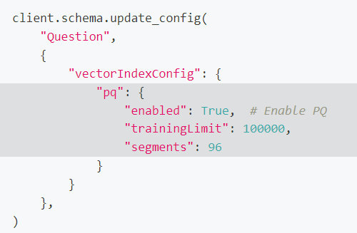
        - PQ量化两步法：如果不支持AutoPQ,可以使用两步法，先加载部分数据进行训练，然后加载其他数据，针对python v4，设置client.collection.config.update(    vector_index_config=wvc.Reconfigure.VectorIndex.hnsw(        quantizer=wvc.Reconfigure.VectorIndex.Quantizer.pq()    ))；针对python v3, 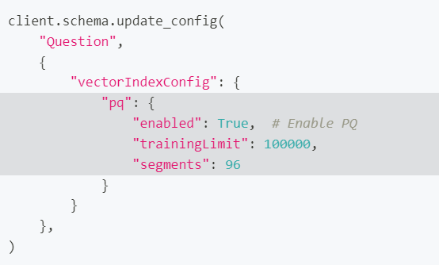
        - PQ量化参数 
        - BQ量化：python v4 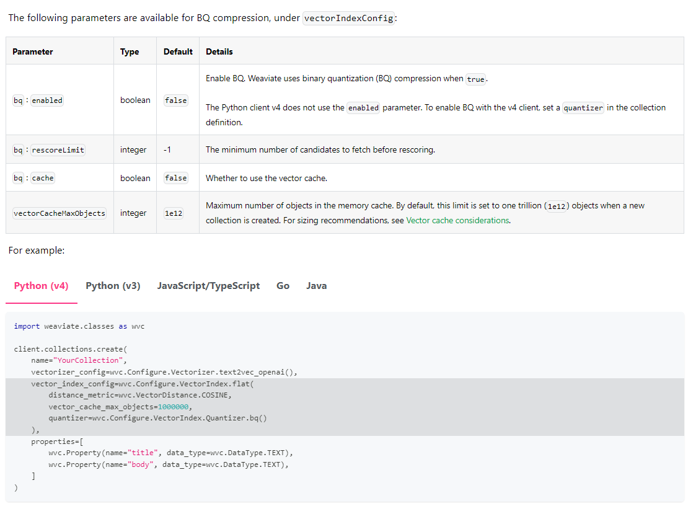
        - BQ量化：python v3 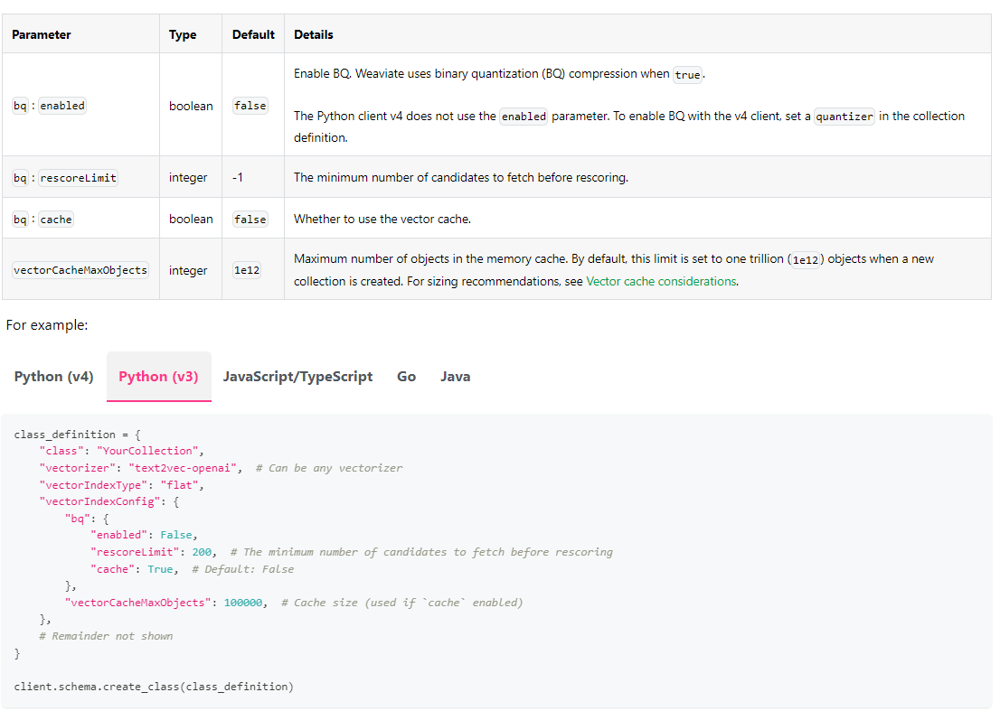
    - 模块
        - 实例级配置：配置模块，配置默认向量模型，配置模块的参数等等。模块包括：vectorizer、Ranker、QA（qna-transformers 模块尝试在指定类的数据对象中找到答案。如果在给定的certainty范围内找到答案则返回，否则）、NER、Summarization和定制化模块。
            - text2vec-transformers
                - **在weaviate容器内** ：text2vec-transformers将模型封装在 Docker 容器中，从而允许在启用 GPU 的硬件上进行独立扩展，同时将 Weaviate 保留在仅 CPU 的硬件上，因为 Weaviate 是针对 CPU 优化的。启用此模块将启用nearText运算符。该模块仅与封装在 Docker 容器中的模型兼容。用户可以选择与transformers库兼容的模型来构建text2vec-tranformers镜像。 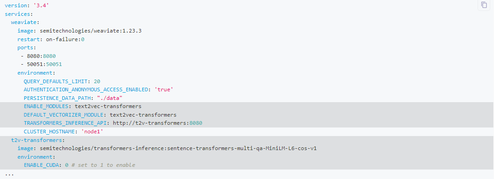
                - 独立的text2vec-transformers容器：在docker-compose文件内开启text2vec-transformers选项，省略t2v-transformers参数，然后使用docker运行独立的容器，最后设定TRANSFORMERS_INFERENCE_API到weaviate的docker-compose。例如，如果weaviate和inference是分离的，设定TRANSFORMERS_INFERENCE_API=" "；如果不是分离的，可以设定TRANSFORMERS_INFERENCE_API=http://t2v-transformers:8080。 [http://localhost:8000]("http://localhost:8000/")
                - class-level可以选择自己的vectorizer, property-level可以选择跳过vectorizer.
                - 构建huggingface hub模型dockerfile: `FROM semitechnologies/transformers-inference:customRUN MODEL_NAME=distilroberta-base ./download.py`
                - 构建本地模型dockerfile: `FROM semitechnologies/transformers-inference:customCOPY ./my-model /app/models/model`
                - 构建dockerfile： `docker build -f my-model.Dockerfile -t my-model-inference .`
                - 独立运行模型dokcerfile： `docker run -itp "8000:8080" my-model-inference`
            - reranker-transformers
                - reranker-transformers支持cross-encoder/ms-marco-MiniLM-L-6-v2，cross-encoder/ms-marco-MiniLM-L-2-v2，cross-encoder/ms-marco-TinyBERT-L-2-v2三个模型 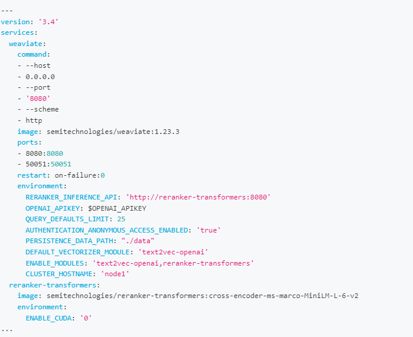
    - 备份
        - 本地备份通过在ENABLE_MODULES添加backup-filesystem启动，然后添加环境变量BACKUP_FILESYSTEM_PATH。Weaviate 将备份编排与远程备份存储后端解耦。可以轻松通过API添加信的备份应用，例如POST /v1/backups/filesystem. 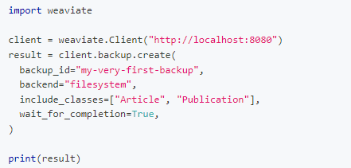
    - 搜索
        - 基本检索
            - limit限制返回条目数，offset控制分页，支持按property、vector、id、cross-reference、metadata检索
        - 混合检索
            - 支持控制bm25的权重，指定fusion_type,fusion_type为Relative_Score时，需指定auto_limit,将结果限制为与查询距离相似的组
    - 监控
        - 通过设置 PROMETHEUS_MONITORING_ENABLED=true 可以收集指标并以 Prometheus 兼容的格式暴露，设置PROMETHEUS_MONITORING_PORT调整metrics端口，默认为<hostname>:2112/metrics。如果设置了多租户，可设置 PROMETHEUS_MONITORING_GROUP=true 将所有租户的数据分组在一起进行监控。
    - 权限控制
        - 授权：授权插件允许 Weaviate 根据用户的身份验证状态为他们提供差异化的访问权限。 除了允许或禁止匿名访问之外，Weaviate 还可以区分管理员列表或只读列表中的用户。 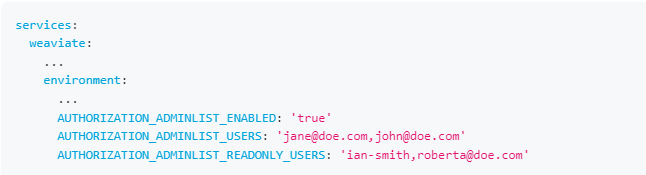
        - 验证：weaviate支持API和OIDC两种验证方式 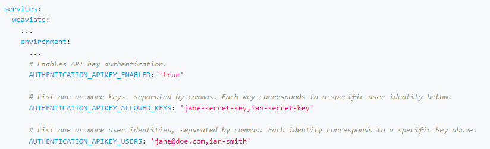
    - 持久化
        - DISK_USE_WARNING_PERCENTAGE，DISK_USE_READONLY_PERCENTAGE用于硬盘压力报警机制，可以通过设置 PERSISTENCE_LSM_ACCESS_STRATEGY 环境变量，在 mmap（默认）和 pread 函数之间进行选择来访问虚拟内存。
    - 副本
        - 副本默认情况下处于禁用状态，可以在集合配置中针对每个数据类启用副本。当您添加（写入）或查询（读取）数据时，集群中的一个或多个副本节点将响应请求。 有多少节点需要向协调节点发送成功的响应和确认取决于consistency_level。 可选的consistency_level为 ONE、QUORUM（replication_factor 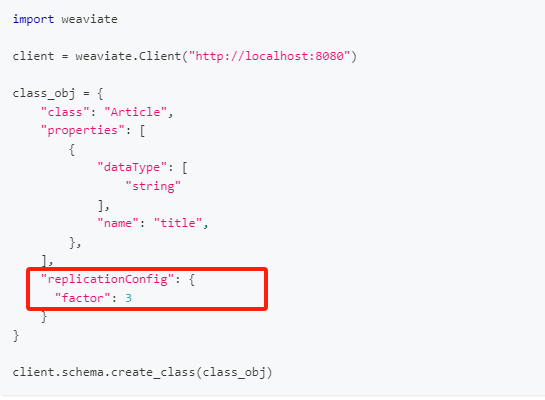
- 数据管理
    - collection管理：在collection里可以进行属性(模块的配置、数据类型、tokenizer)、向量模型、向量模型配置、索引类型、索引类型参数（包括量化、distance）、生成模块配置、副本配置、分片配置、多租户配置，collection配置支持update、delete和读取操作，但注意python v3和v4机制不一样
    - 创建数据对象：object支持只加载文本、向量和文本联合加载、v3版本支持加载前校验，支持batch加载，batch的streaming加载（用于在内存资源不足时的分步加载），支持多租户读取数据，数据整体更新和部分更新 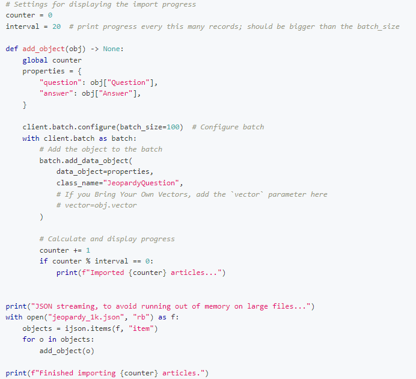
    - 多租户操作：多租户用于隔离不同用户对同一数据集合的操作？在创建class时需指定是否开启多租户，在创建后可增加或删除租户，修改多租户的activation状态，注意查询操作时，如果启用了多租户需指定租户名。
    - 迁移数据：1. 集合到集合-:在目标实例上创建一个集合（例如 WineReview），与源实例上的集合（例如 WineReview）相匹配, 然后将源实例的源集合迁移到目标实例的目标集合；2. 集合到组合迁移：在目标实例上创建一个集合（例如 WineReview），与源实例上的集合（例如 WineReview）相匹配，并为目标集合启用多租户。在添加数据对象之前，在目标实例上添加租户。然后将源实例的源集合迁移到目标实例的目标集合的目标租户上。3. 租户到集合 4. 集合到租户。
- 踩坑记录
    - 注意使用docker compose 安装时，如果要启用gpu，需要预先按照按照 在宿主机上按照container-toolkit [https://docs.nvidia.com/datacenter/cloud-native/container-toolkit/latest/install-guide.html]("https://docs.nvidia.com/datacenter/cloud-native/container-toolkit/latest/install-guide.html")
    - weaviate提供的text2vect-transformers:custom镜像针对bge-large-zh-v1.5有bug，需要手动修改容器中vectorizer.py中关于AutoTokenizer加载方式为use_fast=False, 解决办法：使用如下Dockerfile: `FROM semitechnologies/transformers-inference:custom; COPY ./bge-large-zh-v1.5-finetune-v1.0 /app/models/model; ENV ENABLE_CUDA=1; RUN sed -i 's/AutoTokenizer.from_pretrained(model_path)/AutoTokenizer.from_pretrained(model_path,use_fast=False)/' /app/vectorizer.py` 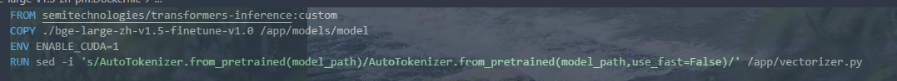
    - weaviate提供的text2vect-transformers:custom镜像必须与weaviate配合启动,否则会报错’remote inference is not initialized'
    - 建立collection时：1. 如果多租户启用则不能启用sharding；2. replication配置的factor必须小于节点数，否则会报错：init sharding state: not enough replicas: found 1 want 2；3. 多租户下不支持insert_many方法批量插入;4. wvc.Configure.Vectorizer.text2vec_transformers的参数不能调整，只能接受默认参数；5. 创建collection后， **系统会自动将class name的首字母改为大写，且至少backup对class name大小写敏感，导致找不到class错误。**
    - 备份需要手动进行，且需要docker-compose.yml在ENABLE_MODULES开启backup-filesystem,且filesystem仅支持单节点备份；